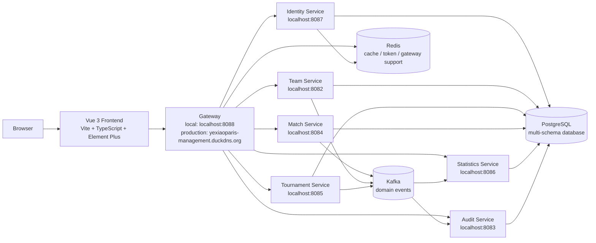
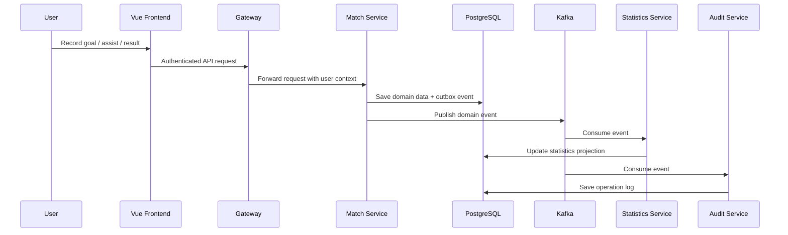

# Team Management System

> A football team operations platform built with Spring Boot microservices and a Vue 3 administration frontend.

Team Management System is designed for managing **one club/team and the tournaments it participates in**. It is not a league-wide public platform. The system focuses on day-to-day football operations: team records, players, tournaments, matches, appearances, goals, assists, statistics, audit logs, authentication, and role-based access control.


---

## 1. Project Overview

Team Management System is a full-stack football team management platform using a **Spring Boot microservices backend** and a **Vue 3 + TypeScript frontend**.

The platform helps a football team manage:

- Team and player information
- Tournament participation
- Match scheduling and result recording
- Player appearances
- Goal and assist tracking
- Statistics dashboards and leaderboards
- Audit logging for operational traceability
- JWT authentication and RBAC authorization

### Technical Highlights

- 🧩 Microservice-oriented backend boundaries
- 🔐 JWT authentication with role-based access control
- 📘 OpenAPI contract-driven frontend API layer
- ⚡ Vue 3 Composition API with TypeScript
- 📊 Statistics projection views for dashboard and leaderboards
- 🧾 Audit log module with JSON event data viewer
- 📨 Event-driven architecture with Kafka-oriented service integration
- 🐳 Docker-ready deployment model for infrastructure and backend services

---

## 2. Features

### Authentication

- [x] Login page
- [x] JWT authentication
- [x] Access token and refresh token persistence
- [x] Current user loading
- [x] Session restore after browser refresh
- [x] Logout
- [x] 401 handling with automatic logout

### Team Management

- [x] Team list
- [x] Team detail
- [x] Create team
- [x] Update team
- [x] Backend pagination
- [x] ADMIN / COACH write access
- [x] PLAYER read-only access

### Player Management

- [x] Player list
- [x] Player detail
- [x] Create player
- [x] Update player
- [x] Change player status
- [x] Backend pagination
- [x] ADMIN / COACH write access
- [x] PLAYER read-only access

### Tournament Management

- [x] Tournament list
- [x] Tournament detail
- [x] Create tournament
- [x] Update tournament
- [x] Finish tournament
- [x] Cancel tournament
- [x] Backend pagination

### Match Management

- [x] Match list
- [x] Match detail
- [x] Create match
- [x] Update match result
- [x] Appearance management
- [x] Goal management
- [x] Assist management
- [x] Delete goal
- [x] Delete assist
- [x] Confirmation for destructive operations

### Statistics

- [x] Dashboard overview
- [x] Match statistics
- [x] Player statistics
- [x] Team statistics
- [x] Leaderboards
- [x] Filterable statistics views
- [x] Loading / error / empty states

### Audit

- [x] Audit log list
- [x] Audit log detail
- [x] Audit filters
- [x] Event JSON viewer
- [x] Access restricted to ADMIN in the frontend
- [x] 403 Access Denied page

---

## 3. Architecture



The frontend never calls individual service ports directly. All API requests go through the backend gateway:

```text
Local:      http://localhost:8088
Production: http://yexiaoparis-management.duckdns.org
```

---

## 4. Microservices

| Service | Local Port | Responsibility | Key APIs |
| --- | ---: | --- | --- |
| Gateway Service | `8088` | Unified API entry, routing, auth enforcement, user context propagation | Proxies all `/api/**` requests |
| Identity Service | `8087` | Authentication, JWT, users, roles, current user profile | `POST /api/auth/login`, `GET /api/auth/me`, `POST /api/auth/logout`, `GET /api/roles`, `/api/users/**` |
| Team Service | `8082` | Team and player management | `GET /api/teams`, `GET /api/teams/{id}`, `POST /api/teams`, `PUT /api/teams/{id}`, `GET /api/players`, `PATCH /api/players/{id}/status` |
| Tournament Service | `8085` | Tournament lifecycle management | `GET /api/tournaments`, `POST /api/tournaments`, `PUT /api/tournaments/{id}`, `PATCH /api/tournaments/{id}/finish`, `PATCH /api/tournaments/{id}/cancel` |
| Match Service | `8084` | Match scheduling, results, appearances, goals, assists | `GET /api/v1/matches`, `POST /api/v1/matches`, `PATCH /api/v1/matches/{id}/result`, `PUT /api/v1/matches/{id}/appearances`, `/api/v1/goals/**` |
| Statistics Service | `8086` | Read-optimized projections, dashboard, leaderboards | `GET /api/statistics/dashboard`, `/matches`, `/players`, `/teams`, `/leaderboards` |
| Audit Service | `8083` | Audit operation log query and event data inspection | `GET /api/audit/logs`, `GET /api/audit/logs/{id}` |

---

## 5. Event-Driven Architecture

The system is designed around service ownership and asynchronous propagation of domain changes.

### Kafka Event Flow

- **Producers**: services that own write operations, such as Match, Team, and Tournament.
- **Consumers**: Statistics and Audit services consume events to build read models and operation logs.
- **Outbox Pattern**: write-side services can persist domain changes and event records atomically before publishing.
- **Idempotent Consumer**: consumers should process repeated events safely using event IDs or processed-message records.



This design keeps business writes focused in the owning service while allowing Statistics and Audit to evolve as independent read models.

---

## 6. Database Design

### Multi-Schema PostgreSQL Architecture

The backend is organized as a multi-schema PostgreSQL architecture:

```text
PostgreSQL
├── identity
├── team
├── tournament
├── match
├── statistics
└── audit
```

### Why No Cross-Service Foreign Keys?

Microservices should own their data. Cross-service foreign keys create hidden runtime coupling and make independent deployment, migration, and scaling harder.

Instead of database-level coupling:

- Services reference external entities by ID.
- User-facing names are stored as snapshots when needed.
- Consistency across services is maintained through APIs and domain events.

### Why Use Snapshots?

Match and statistics records often need historical truth. For example, a player name or tournament name may change later, but historical match records should still display the name as it was when the match happened.

Snapshot fields solve this:

- `playerNameSnapshot`
- `jerseyNumberSnapshot`
- `tournamentNameSnapshot`
- `seasonSnapshot`
- `ourTeamNameSnapshot`
- `opponentTeamNameSnapshot`

---

## 7. Security

### JWT Authentication

The frontend authenticates through the Identity Service via the Gateway. After login, the frontend stores:

- `accessToken`
- `refreshToken`
- `currentUser`

Authentication state is restored on browser refresh by calling:

```http
GET /api/auth/me
```

### RBAC Authorization

Role-based access control is enforced by the backend and reflected in the frontend UI.

| Role | Permission Model |
| --- | --- |
| `ADMIN` | Full system access, including Audit |
| `COACH` | Business write access, no Audit access in frontend |
| `PLAYER` | Read-only access to business data |

### Gateway Validation

The Gateway is the unified API entry and should validate tokens before forwarding requests.

### User Context Headers

After authentication, the Gateway can propagate user context to downstream services, such as:

```text
X-User-Id
X-Username
X-Roles
```

Downstream services can use this context for authorization, audit logging, and event metadata.

---

## 8. Frontend

The frontend is implemented as a Vue 3 administration application.

### Frontend Stack

- Vue 3 Composition API
- TypeScript
- Vite
- Vue Router
- Pinia
- Axios
- Element Plus
- SCSS

### Frontend Capabilities

- Protected routes
- JWT session restore
- Role-aware sidebar
- 403 Access Denied page
- 404 Not Found page
- Global Axios error handling
- API layer aligned with OpenAPI contracts
- Shared UI primitives for loading, empty, error, header, and card layouts

### Screenshots

Coming Soon

---

## 9. API Documentation

API contracts are stored in:

```text
openapi/
```

Current OpenAPI files:

| Contract | Service |
| --- | --- |
| `identity.json` | Identity Service |
| `team.json` | Team Service and Player APIs |
| `tournament.json` | Tournament Service |
| `match.json` | Match Service |
| `statistics.json` | Statistics Service |
| `audit.json` | Audit Service |

### OpenAPI Contract-Driven Development

The frontend API layer and TypeScript DTOs are implemented from the OpenAPI contracts. When backend contracts change, frontend types and API calls should be updated from the contract first, not from guessed response shapes.

Example frontend API modules:

```text
src/api/
├── auth.ts
├── team.ts
├── player.ts
├── tournament.ts
├── match.ts
├── statistics.ts
└── audit.ts
```

Swagger UI availability depends on the backend runtime configuration. Typical Spring Boot OpenAPI endpoints are:

```text
http://localhost:<service-port>/swagger-ui.html
http://localhost:<service-port>/v3/api-docs
```

---

## 10. Tech Stack

| Layer | Technologies |
| --- | --- |
| Backend | Spring Boot Microservices, Spring Security, OpenAPI |
| Frontend | Vue 3, TypeScript, Vite, Pinia, Vue Router, Element Plus |
| Database | PostgreSQL, multi-schema service ownership |
| Messaging | Kafka |
| Caching | Redis |
| Infrastructure | Gateway, Docker-ready service topology |
| DevOps | Docker Compose-oriented local deployment, production build pipeline |
| API Contract | Swagger / OpenAPI |

---

## 11. Getting Started

### Prerequisites

Install the following tools:

- Node.js 20+
- npm
- Java 17+
- Docker
- Docker Compose
- PostgreSQL
- Redis
- Kafka

For frontend-only development, Node.js and a running backend Gateway are enough.

---

## 12. Local Development

### Frontend

The local Vite environment uses `.env.development`:

```env
VITE_API_BASE_URL=http://localhost:8088
```

Install dependencies:

```bash
npm install
```

Start the Vite dev server:

```bash
npm run dev
```

Frontend URL:

```text
http://localhost:5173
```

### Backend

Start backend services from the backend workspace. This frontend repository expects the Gateway to be available at:

```text
http://localhost:8088
```

Service ports from the OpenAPI contracts:

```text
Team Service         8082
Audit Service        8083
Match Service        8084
Tournament Service   8085
Statistics Service   8086
Identity Service     8087
Gateway              8088
```

### Docker

This frontend repository does not currently include Docker Compose files. In the full system workspace, Docker Compose should start:

- PostgreSQL
- Redis
- Kafka
- Gateway
- Identity Service
- Team Service
- Tournament Service
- Match Service
- Statistics Service
- Audit Service

Common command shape:

```bash
docker compose up -d
```

### Gateway

All frontend API requests must go through the Gateway:

```text
VITE_API_BASE_URL=http://localhost:8088
```

Do not configure the frontend to call service ports such as `8087`, `8084`, or `8086` directly.

---

## 13. Environment Variables

### Frontend

The frontend reads its backend gateway URL from `VITE_API_BASE_URL`. Vite loads the correct file by mode:

| File | Mode | Backend Gateway URL |
| --- | --- | --- |
| `.env.development` | Local development | `http://localhost:8088` |
| `.env.production` | Production build | `http://yexiaoparis-management.duckdns.org` |

Local development:

```env
VITE_API_BASE_URL=http://localhost:8088
```

Production:

```env
VITE_API_BASE_URL=http://yexiaoparis-management.duckdns.org
```

Only public frontend configuration belongs in committed Vite env files. Do not commit real passwords, JWT secrets, private tokens, `.env.local`, or secret production env files.

### Gateway

```env
SERVER_PORT=8088
JWT_SECRET=<replace-with-secure-secret>
REDIS_HOST=localhost
REDIS_PORT=6379
```

### Identity Service

```env
SERVER_PORT=8087
DB_URL=jdbc:postgresql://localhost:5432/team_management
DB_SCHEMA=identity
DB_USERNAME=<db-user>
DB_PASSWORD=<db-password>
JWT_SECRET=<replace-with-secure-secret>
```

### Team / Tournament / Match / Statistics / Audit Services

```env
DB_URL=jdbc:postgresql://localhost:5432/team_management
DB_USERNAME=<db-user>
DB_PASSWORD=<db-password>
KAFKA_BOOTSTRAP_SERVERS=localhost:9092
REDIS_HOST=localhost
REDIS_PORT=6379
```

### Kafka

```env
KAFKA_BOOTSTRAP_SERVERS=localhost:9092
```

### Redis

```env
REDIS_HOST=localhost
REDIS_PORT=6379
```

Never commit real passwords, JWT secrets, production tokens, or cloud credentials.

---

## 14. Build & Run

### Frontend Build

Production builds use `.env.production` and point API requests at:

```text
http://yexiaoparis-management.duckdns.org
```

```bash
npm run build
```

Preview the production build locally:

```bash
npm run preview
```

### Backend Build

From the backend workspace:

```bash
./mvnw clean package
```

or, for Gradle-based services:

```bash
./gradlew build
```

### Docker Compose

From the full system workspace:

```bash
docker compose up -d
```

### Production Compose

A production compose setup should include:

- Externalized environment variables
- No hardcoded secrets
- Frontend built with `VITE_API_BASE_URL=http://yexiaoparis-management.duckdns.org`
- Persistent PostgreSQL volumes
- Kafka and Redis health checks
- Service restart policies
- Gateway exposed publicly
- Internal service ports kept private

Example command shape:

```bash
docker compose -f docker-compose.yml -f docker-compose.prod.yml up -d
```

---

## 15. Roadmap

### Current Status

- [x] Authentication
- [x] RBAC-aware frontend navigation
- [x] Team module
- [x] Player module
- [x] Tournament module
- [x] Match module
- [x] Appearance, goal, and assist management
- [x] Statistics dashboard and leaderboards
- [x] Audit log list and detail
- [x] OpenAPI-aligned frontend API layer
- [x] 403 and 404 pages
- [x] Environment-based API URL

### Future Plans

- [ ] CI/CD pipeline
- [ ] Prometheus metrics
- [ ] Grafana dashboards
- [ ] E2E testing
- [ ] Unit tests for permission utilities
- [ ] Global pagination component
- [ ] More shared table and form components
- [ ] Kubernetes deployment
- [ ] Frontend screenshot documentation
- [ ] Dark mode

---

## 16. Project Status

```text
Backend          100%
Frontend          90%
Deployment        Ready
Production        Ready for controlled environment
Documentation     In Progress
```

The frontend is functionally complete for the core management workflow. Remaining work is focused on broader UI polish, automated tests, observability, CI/CD, and production hardening.

---

## 17. Why This Project

This project demonstrates practical full-stack engineering across modern frontend and backend architecture.

For recruiters and interviewers, it highlights:

- **Microservices**: clear service boundaries for identity, team, tournament, match, statistics, and audit.
- **Event-Driven Architecture**: Kafka-oriented projection and audit workflows.
- **CQRS-style Read Models**: statistics are served from dedicated query endpoints.
- **JWT Authentication**: login, token persistence, session restore, and logout.
- **RBAC Authorization**: ADMIN, COACH, and PLAYER behavior across UI and routes.
- **OpenAPI-Driven Development**: frontend DTOs and API mappings are contract-aligned.
- **Docker Deployment Readiness**: infrastructure-oriented local and production deployment model.
- **Vue Frontend Engineering**: Composition API, Pinia state, Vue Router guards, Element Plus UI, and TypeScript.
- **Operational Thinking**: audit logging, JSON event inspection, error states, access denied handling, and gateway-only API access.

The system is intentionally scoped to a real-world team operations domain: not a toy CRUD app, not a generic admin template, and not a league-wide product. It models a focused football management workflow with enough depth to show backend architecture, frontend ergonomics, and production-readiness concerns.

---

## 18. License

MIT License

Copyright (c) 2026

Permission is hereby granted, free of charge, to any person obtaining a copy of this software and associated documentation files, to deal in the Software without restriction, including without limitation the rights to use, copy, modify, merge, publish, distribute, sublicense, and/or sell copies of the Software, subject to the following conditions:

The above copyright notice and this permission notice shall be included in all copies or substantial portions of the Software.

THE SOFTWARE IS PROVIDED "AS IS", WITHOUT WARRANTY OF ANY KIND, EXPRESS OR IMPLIED, INCLUDING BUT NOT LIMITED TO THE WARRANTIES OF MERCHANTABILITY, FITNESS FOR A PARTICULAR PURPOSE AND NONINFRINGEMENT. IN NO EVENT SHALL THE AUTHORS OR COPYRIGHT HOLDERS BE LIABLE FOR ANY CLAIM, DAMAGES OR OTHER LIABILITY, WHETHER IN AN ACTION OF CONTRACT, TORT OR OTHERWISE, ARISING FROM, OUT OF OR IN CONNECTION WITH THE SOFTWARE OR THE USE OR OTHER DEALINGS IN THE SOFTWARE.
