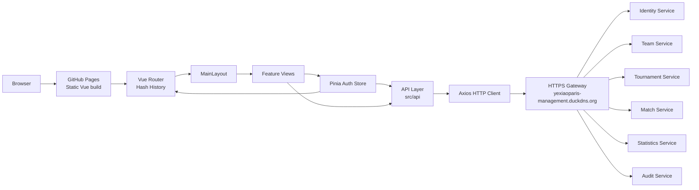
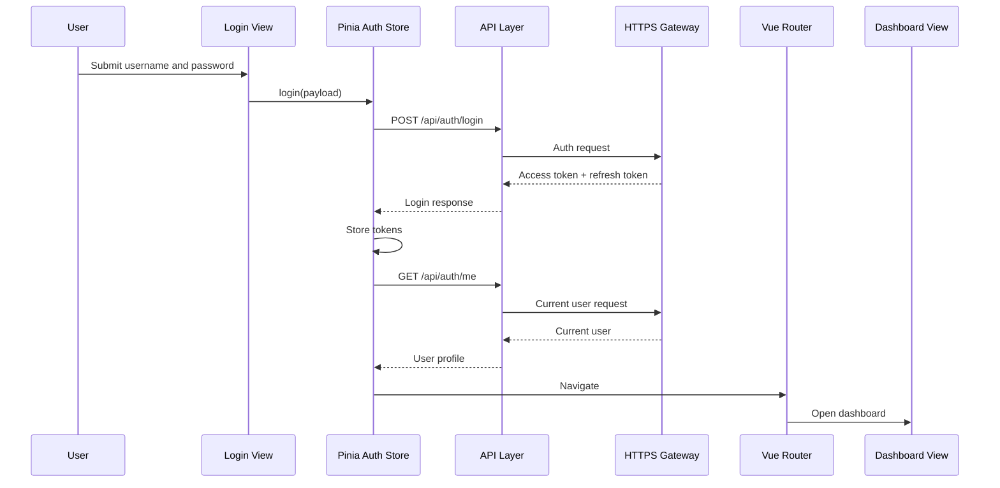

# Team Management Frontend

Vue 3 and TypeScript administration frontend for a football team management platform.


| Link | URL |
| --- | --- |
| Live Demo | https://yukhoi.github.io/team-management-frontend/ |
| Backend API | https://yexiaoparis-management.duckdns.org |
| Backend Repository | To be added. The frontend repository does not currently confirm the backend repository URL. |

## Project Overview

Team Management Frontend is a football club administration UI. It is designed for managing one club and its operational data, not for running a public league platform.

The application helps staff:

- Manage the club and its players
- Manage tournaments and matches
- Record appearances, goals, and assists
- View statistics and leaderboards
- Export leaderboard PDFs
- Manage users and roles
- Review audit logs

The frontend is hosted on GitHub Pages and calls the production backend through a remote HTTPS Gateway.

## Current Architecture


```mermaid
flowchart LR
  Browser["Browser"]
  Pages["GitHub Pages<br/>Static Vue build"]
  Router["Vue Router<br/>Hash History"]
  Layout["MainLayout"]
  Views["Feature Views"]
  Store["Pinia Auth Store"]
  Api["API Layer<br/>src/api"]
  Axios["Axios HTTP Client"]
  Gateway["HTTPS Gateway<br/>yexiaoparis-management.duckdns.org"]
  Identity["Identity Service"]
  Team["Team Service"]
  Tournament["Tournament Service"]
  Match["Match Service"]
  Statistics["Statistics Service"]
  Audit["Audit Service"]

  Browser --> Pages
  Pages --> Router
  Router --> Layout
  Layout --> Views
  Store --> Router
  Store --> Api
  Views --> Store
  Views --> Api
  Api --> Axios
  Axios --> Gateway
  Gateway --> Identity
  Gateway --> Team
  Gateway --> Tournament
  Gateway --> Match
  Gateway --> Statistics
  Gateway --> Audit
```

GitHub Pages serves static assets only. It is not an API proxy; the browser calls the HTTPS Gateway directly.

## Tech Stack

| Area | Technology |
| --- | --- |
| Framework | Vue 3 |
| Language | TypeScript |
| Build Tool | Vite |
| UI Library | Element Plus |
| Icons | @element-plus/icons-vue |
| State Management | Pinia |
| Routing | Vue Router |
| HTTP Client | Axios |
| Styling | Sass |
| PDF Generation | pdf-lib |
| PDF Font Support | @pdf-lib/fontkit |
| API Contract | OpenAPI JSON files |
| Hosting | GitHub Pages |
| CI/CD | GitHub Actions |

## Key Engineering Decisions

### OpenAPI-driven frontend

Backend contracts are stored in `openapi/`:

```text
openapi/
├── audit.json
├── identity.json
├── match.json
├── statistics.json
├── team.json
└── tournament.json
```

Contract update workflow:

```text
Update backend
→ Export OpenAPI
→ Replace contract file
→ Update TypeScript types
→ Update API layer
→ Update affected views
```

### API Layer

Views do not call Axios directly. API requests are centralized in `src/api/`:

```text
src/api/
├── audit.ts
├── auth.ts
├── http.ts
├── index.ts
├── match.ts
├── player.ts
├── statistics.ts
├── team.ts
└── tournament.ts
```

`src/api/http.ts` configures the base URL, JSON headers, JWT `Authorization` header, and global `401` / `403` response handling.

### Role-based access control

Supported role codes:

| Role | Usage |
| --- | --- |
| `ADMIN` | Full administration, including users and audit logs |
| `COACH` | Business-data management |
| `PLAYER` | Read-oriented access |

Frontend RBAC controls route access, menu visibility, and write-action visibility. The Gateway and backend services remain the authoritative security layer.

### GitHub Pages routing

The router uses:

```ts
createWebHashHistory(import.meta.env.BASE_URL)
```

Production URLs therefore use hash routes, for example:

```text
https://yukhoi.github.io/team-management-frontend/#/matches
```

Hash History avoids GitHub Pages deep-link refresh `404` errors.

## Implemented Features

### Authentication and Account

- [x] Login
- [x] Access and refresh token persistence in `localStorage`
- [x] Current-user restoration on app startup
- [x] Logout
- [x] Route guards
- [x] Role-aware menu visibility
- [x] Access Denied page
- [x] Not Found page
- [x] Change Password

### Dashboard

- [x] Current username and roles
- [x] Total matches, wins, draws, losses
- [x] Goals and goals against
- [x] Top scorer and top scorer goals
- [x] Top assist player and assist count
- [x] Loading, empty, error, and retry states

### Team Management

- [x] Team list
- [x] Team detail
- [x] Create team
- [x] Update team
- [x] Backend pagination
- [x] Club-own-team lookup through `GET /api/teams/our`
- [x] `ADMIN` / `COACH` write-action visibility

### Player Management

- [x] Player list
- [x] Player detail
- [x] Create player
- [x] Update player
- [x] Player status change
- [x] Backend pagination
- [x] Automatic assignment to the club's own team during player creation
- [x] `ADMIN` / `COACH` write-action visibility

### Tournament Management

- [x] Tournament list
- [x] Tournament detail
- [x] Create tournament
- [x] Update tournament
- [x] Finish tournament
- [x] Cancel tournament
- [x] Backend pagination

### Match Management

- [x] Match list
- [x] Match detail
- [x] Create match
- [x] Update result
- [x] Appearance management
- [x] Goal management
- [x] Assist management
- [x] Delete goal and assist with confirmation
- [x] Our team is loaded automatically
- [x] Opponent team is selected by name from team records
- [x] Team snapshots are generated from short names when available
- [x] Goal and assist player options are restricted to match appearances
- [x] Player options are sorted alphabetically
- [x] Appearance editor avoids duplicate player selection

### Statistics

- [x] Dashboard statistics
- [x] Match statistics
- [x] Player statistics
- [x] Team statistics
- [x] Leaderboards
- [x] Season filter for player statistics and leaderboards
- [x] Tournament-name filter for player statistics and leaderboards
- [x] Tournament ID filter for match and team statistics
- [x] Board type filter for leaderboards
- [x] Top N filter for leaderboards
- [x] Automatic refresh for player-statistics filter changes
- [x] Initial automatic load for dashboard, match statistics, team statistics, player statistics, and leaderboards

### PDF Export

The leaderboard export follows the project rule:

```text
What You See Is What You Export
```

- [x] Fixed PDF template
- [x] Scorer leaderboard export
- [x] Assist leaderboard export
- [x] Appearance leaderboard export
- [x] Current filter context determines export content
- [x] Dynamic title from club name, season, tournament, and board type
- [x] Appearance count in scorer and assist PDFs
- [x] Chinese text support
- [x] Public asset path support for GitHub Pages subpaths

### User Management

- [x] User list
- [x] Create user
- [x] Status update
- [x] Role update
- [x] Password reset
- [x] Search, role filter, and status filter in the current page data
- [x] `ADMIN`-only route and menu access

### Audit

- [x] Audit list
- [x] Audit detail
- [x] Filter by service, operation, resource type, keyword, and time range
- [x] JSON payload display
- [x] `ADMIN`-only route and menu access

## Project Structure

```text
src/
├── api/                 # HTTP client and domain API functions
├── components/common/   # Shared Vue components
├── generated/           # Generated OpenAPI client artifacts
├── layouts/             # Authenticated application layout
├── router/              # Route table and navigation guards
├── services/export/     # PDF export and browser download utilities
├── stores/              # Pinia stores
├── styles/              # Global styles
├── types/               # TypeScript DTO and API response types
├── utils/               # Tokens, permissions, and public asset helpers
└── views/               # Page-level modules

openapi/                 # Backend OpenAPI contracts
public/fonts/            # Optional PDF font assets and font notes
public/templates/        # Static PDF templates
.github/workflows/       # GitHub Pages deployment workflow
```

## Authentication Flow


```mermaid
sequenceDiagram
  participant User
  participant Login as Login View
  participant Store as Pinia Auth Store
  participant API as API Layer
  participant Gateway as HTTPS Gateway
  participant Router as Vue Router
  participant Dashboard as Dashboard View

  User->>Login: Submit username and password
  Login->>Store: login(payload)
  Store->>API: POST /api/auth/login
  API->>Gateway: Auth request
  Gateway-->>API: Access token + refresh token
  API-->>Store: Login response
  Store->>Store: Store tokens
  Store->>API: GET /api/auth/me
  API->>Gateway: Current user request
  Gateway-->>API: Current user
  API-->>Store: User profile
  Store->>Router: Navigate
  Router->>Dashboard: Open dashboard
```

On application startup, `src/main.ts` calls `restoreAuth()` before mounting the router. Global Axios handling logs the user out and redirects to `/login` on `401`; it shows an access error and redirects to `/403` on `403`.

## Environment Configuration

Vite exposes only variables prefixed with `VITE_` to the frontend. Do not put secrets in frontend environment files.

```env
# .env.development
VITE_API_BASE_URL=http://localhost:8088
```

```env
# .env.production
VITE_API_BASE_URL=https://yexiaoparis-management.duckdns.org
```

Vite production mode uses `.env.production`, and the GitHub Actions deployment also sets `VITE_API_BASE_URL` during the build.

## Getting Started

### Prerequisites

- Node.js 22 is used by the GitHub Actions workflow
- npm
- A running backend Gateway

### Installation

```bash
git clone https://github.com/Yukhoi/team-management-frontend.git
cd team-management-frontend
npm ci
```

### Development

```bash
npm run dev
```

### Production build

```bash
npm run build
```

### Production preview

```bash
npm run preview
```

## Backend Requirements

The deployed frontend expects the Gateway to be reachable at:

```text
https://yexiaoparis-management.duckdns.org
```

Backend requirements:

- Gateway must be online
- HTTPS certificate must be valid
- CORS must allow `https://yukhoi.github.io`
- Test accounts are not stored in this README
- Swagger availability depends on backend configuration

## PDF Export Details

PDF export code lives in:

```text
src/services/export/
├── download.ts
├── leaderboardExporter.ts
├── leaderboardMapper.ts
├── pdfEngine.ts
└── pdfTemplate.ts
```

Static assets:

```text
public/templates/leaderboard-template.pdf
public/fonts/
```

The template and optional Chinese font are resolved with `import.meta.env.BASE_URL`, so they work under the GitHub Pages subpath. `src/utils/publicAsset.ts` provides the same base-path-safe approach for other public assets.

The export engine first tries to load `public/fonts/NotoSansSC-Regular.ttf`. That font file is not currently committed. If the font is unavailable, non-ASCII text is rendered to PNG through browser canvas and embedded into the PDF.

## Deployment to GitHub Pages

Deployment is handled by:

```text
.github/workflows/deploy-pages.yml
```

Workflow:

```text
Push to main
→ npm ci
→ npm run build
→ Upload dist
→ Deploy to GitHub Pages
```

Production URL:

```text
https://yukhoi.github.io/team-management-frontend/
```

`vite.config.ts` sets:

```ts
base: mode === 'production'
  ? '/team-management-frontend/'
  : '/'
```

The router uses Hash History for GitHub Pages compatibility.

## Common Deployment Issues

### Login returns 405 from github.io

Cause: `VITE_API_BASE_URL` was missing during the production build.

Wrong request:

```text
https://yukhoi.github.io/api/auth/login
```

Correct request:

```text
https://yexiaoparis-management.duckdns.org/api/auth/login
```

### CORS error

The Gateway must allow:

```text
https://yukhoi.github.io
```

### PDF template returns 404

Public assets must be resolved through `BASE_URL` or the `getPublicAsset()` helper so `/team-management-frontend/` is included in production.

### Route refresh returns 404

The project uses Hash History to avoid deep-route refresh errors on GitHub Pages.

## Available Scripts

| Command | Description |
| --- | --- |
| `npm run dev` | Start the Vite development server |
| `npm run build` | Type-check the project and build production assets |
| `npm run preview` | Preview the production build locally |

## Testing and Quality

Current quality tooling:

| Area | Current State |
| --- | --- |
| Type checking | Included in `npm run build` through `vue-tsc -b` |
| Unit tests | Not configured |
| Component tests | Not configured |
| E2E tests | Not configured |
| ESLint | Not configured |
| Prettier | Not configured |

Automated frontend testing is planned.

Manual regression focus areas:

- Authentication and token restoration
- RBAC route, menu, and action visibility
- Team, player, tournament, and match CRUD flows
- Match appearances, goals, and assists
- Statistics filters and data loading
- PDF export
- GitHub Pages routing and public assets

## Project Status

| Module | Status |
| --- | --- |
| Authentication | Completed |
| Team | Completed |
| Player | Completed |
| Tournament | Completed |
| Match | Completed |
| Statistics | Completed |
| PDF Export | Completed |
| User Management | Completed |
| Audit | Completed |
| Change Password | Completed |
| GitHub Pages Deployment | Completed |
| Automated Testing | Planned |
| ESLint / Prettier Quality Gates | Planned |

## Roadmap

- Automated unit and component tests
- End-to-end tests
- Better mobile responsiveness
- Monitoring and frontend error reporting
- Accessibility improvements
- More PDF reports
- Custom domain
- CI quality gates

## Security Notes

- No secrets belong in `VITE_*` variables
- JWT access tokens are sent through the `Authorization` header
- UI permission checks do not replace backend authorization
- Passwords must never be committed or logged
- The production Gateway uses HTTPS

## Screenshots

Screenshots will be added as the production UI is finalized.

## License

This project is licensed under the MIT License. See [LICENSE](./LICENSE).
